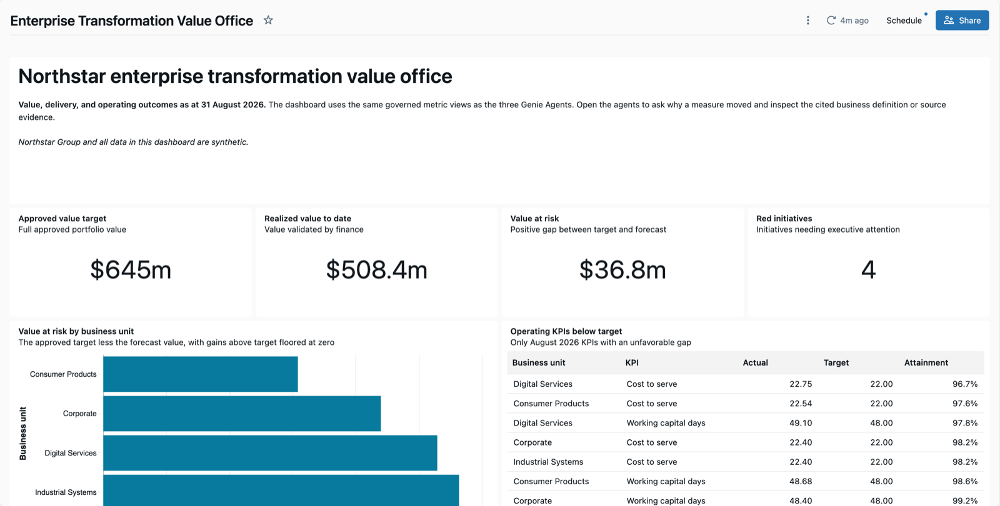
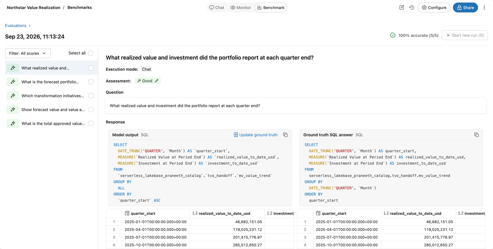

# Genie Ontology enterprise transformation demo

A deployable Databricks demo that shows how to **build** a Genie Ontology, not just query one.

One command creates a synthetic enterprise transformation portfolio, models it as governed
Unity Catalog semantics, and puts three Genie Agents, an executive dashboard, and an
automated benchmark suite on top of it.

Northstar Group is fictional. This repository contains no customer data and no internal
Databricks content.



## Contents

- [What you get](#what-you-get)
- [Which ontology capabilities this demo models](#which-ontology-capabilities-this-demo-models)
- [Before you start](#before-you-start)
- [Deploy it](#deploy-it)
- [Remove it](#remove-it)
- [Run the benchmarks](#run-the-benchmarks)
- [Import the Pages](#import-the-pages)
- [Run the demo](#run-the-demo)
- [Change it](#change-it)
- [Repository map](#repository-map)
- [Product status](#product-status)
- [Design choices](#design-choices)

## What you get

One `make deploy` creates all of this in a catalog you choose.

| Asset | Name | Purpose |
|---|---|---|
| Tables | `initiatives`, `portfolio_monthly`, `risks`, `milestones`, `portfolio_documents`, `operating_kpi_monthly` | Deterministic synthetic portfolio, risk, milestone, document, and KPI data. |
| Summary views | `v_initiative_progress`, `v_initiative_risk_summary`, `v_initiative_milestone_summary`, `v_initiative_latest_document` | One row per initiative each. These are the join targets for the metric views. |
| Detail view | `v_initiative_current` | Row level companion for questions the metric views do not cover. |
| Metric view | `mv_value_realization` | Approved value, plan, realized value, forecast, investment, and return. |
| Metric view | `mv_delivery_health` | Health, progress, risks, milestones, and the latest evidence. |
| Metric view | `mv_value_trend` | Month over month and quarter end value using semiadditive window measures. |
| Metric view | `mv_operating_performance` | Operating KPIs against target, with a trailing three month average. |
| Genie Agents | Northstar Value Realization, Northstar Delivery Risk, Northstar Operating Performance | Three focused agents with instructions, verified SQL, and benchmarks. |
| Dashboard | Enterprise Transformation Value Office | Executive starting point on the same governed measures. |
| Jobs | setup, regression tests | Build the demo and check 14 benchmark questions. |
| Domain | `Enterprise Transformation` plus three subdomains | Organizes every asset above by business purpose. |
| Pages | Eight committed Markdown definitions in `docs/pages` | Business terms. These need a short manual import. |

## Which ontology capabilities this demo models

The point of the repository is the modeling, so each capability appears somewhere you can
open and read it.

| Capability | Where to look |
|---|---|
| Relationships as `joins` | `mv_value_realization` and `mv_delivery_health` source `initiatives` and join the summary views on `initiative_id`. The entity graph lives in the metric view, not in a flattening SQL view. |
| Semiadditive window measures | `mv_value_trend` measures use `window: [{order, range, semiadditive}]` so cumulative months are never added together. |
| Trailing window measures | `Actual Three Month Average` in `mv_operating_performance`. |
| Agent metadata | Every field and measure carries `display_name`, a `comment` that states the business definition, and `synonyms` where users have another word for it. |
| The `fields` keyword | All metric views use `fields`, the current preferred keyword, rather than the older `dimensions`. |
| Domains and subdomains | `src/ontology/domains.json` plus the governed tags the setup job applies to every table, view, metric view, dashboard, and agent. |
| Certification | The setup job certifies all twelve curated tables and views with `system.certification_status`. |
| Keys and grain | Primary key on `initiatives`, foreign keys from every child table, plus table and column comments. |
| Pages | Eight term definitions in `docs/pages`, each with owner, synonyms, calculation, related assets, and source. |
| Benchmarks | Fourteen committed questions with SQL answers, run by a job that fails on a wrong or unreviewed result. |

`docs/ONTOLOGY.md` maps the whole thing, including the context Databricks infers rather
than the context you model.

## Before you start

Plan about an hour for the first run: a few minutes of setup, about ten minutes for the
setup job, several minutes for the benchmarks, and the manual Page import.

On your machine you need Python 3.12, [`uv`](https://docs.astral.sh/uv/), `jq`, `make`, and
Databricks CLI 1.17 or later (tested with 1.17.0).

In the workspace, confirm each of these before the first deploy. The first four are
workspace or account settings, so an admin usually has to turn them on.

| Requirement | Who can provide it | Without it |
|---|---|---|
| Serverless compute and a serverless SQL warehouse | Workspace admin | Nothing deploys. |
| Genie Agents, with benchmarks | Workspace admin | No agents and no benchmark run. |
| Unity Catalog metric views with YAML version 1.1 | Workspace admin | The setup job fails at the metric views. |
| Genie Ontology, Genie One, Domains, and Pages previews | Account admin, in the account previews page | Acts 4 and 5 of the demo script cannot run. Everything else works. |
| An existing catalog where you can create a schema | Catalog owner or metastore admin | Nothing deploys. |
| Permission to create jobs, dashboards, and Genie Agents | Workspace admin | Nothing deploys. |
| Permission to create governed tag policies | Account admin | No domain tags. The setup job warns and continues. |
| `MANAGE DISCOVERY` and a free domain slot for the domain and three subdomains | Account admin | No domain. The setup job warns and continues. |

If a preview is not listed in your account, ask your Databricks account team to enable it.
`docs/DEPLOYMENT.md` has the detail and the recovery step for each warning.

Check your setup locally first. This validates the metric view YAML without touching a
workspace.

```bash
make check
```

## Deploy it

```bash
databricks auth login --profile YOUR_PROFILE \
  --host https://YOUR_WORKSPACE_HOST

make deploy \
  PROFILE=YOUR_PROFILE \
  CATALOG=YOUR_CATALOG \
  WAREHOUSE_ID=YOUR_SQL_WAREHOUSE_ID
```

That runs `make check`, validates the bundle, deploys the dashboard and jobs, then runs the
setup job. The setup job creates the governed tags and domain, builds the data and the
semantic layer, validates it, creates or updates the three Genie Agents, and tags the
dashboard and agents into their domains.

The default schema is `transformation_value_office`. Add `SCHEMA=YOUR_SCHEMA` to use
another name. Omit `PROFILE` to use your default Databricks CLI profile. Nothing is written
into the repository, so the same clone deploys to several workspaces.

The setup keeps going when the account cannot give it everything:

- The account has reached its domain limit, or the identity cannot access domains? It
  keeps the governed tags, prints a warning, and continues to the agents. It never deletes
  an existing domain.
- Cannot create the governed tag policies at all? The data checks report a warning instead
  of failing, and the agents and dashboard still work.

Either way the run prints what it skipped and `docs/DEPLOYMENT.md` has the recovery step.
Read the output of the `deploy_domains` task before you plan to show the domain.

If the schema already exists from an earlier deployment that this clone did not create,
the deploy fails with `SCHEMA_ALREADY_EXISTS`. Choose a new `SCHEMA` name, or drop the old
schema if you own it.

## Remove it

```bash
make destroy \
  PROFILE=YOUR_PROFILE \
  CATALOG=YOUR_CATALOG \
  WAREHOUSE_ID=YOUR_SQL_WAREHOUSE_ID
```

This deletes the three Genie Agents first, because the bundle does not track them, and
then runs `databricks bundle destroy`. Run it in an interactive terminal, because the
destroy step asks for confirmation before it removes the jobs, the dashboard, and the
schema with all its data. Use the same `SCHEMA` value you deployed with.

The governed tag policies and the domain are account wide, so `make destroy` leaves them in
place. Delete them in the account console if nothing else uses them.

## Run the benchmarks

Run this after the setup job finishes.

```bash
make benchmark \
  PROFILE=YOUR_PROFILE \
  CATALOG=YOUR_CATALOG \
  WAREHOUSE_ID=YOUR_SQL_WAREHOUSE_ID
```

The job starts a fresh conversation for each of the fourteen committed questions, compares
the result with the committed SQL answer, and fails if any answer is wrong or still needs
manual review. A run uses model inference and takes several minutes.



The quarter end question shown above is the one that guards the semiadditive rule. Each
quarter returns its closing month, rising to 508.36 million dollars, and never a sum.

## Import the Pages

Databricks does not yet expose a public Pages API, so the eight Page definitions are the
one manual step. `docs/pages/README.md` walks through it and takes a few minutes.

Everything else stays in the bundle. The Page files stay the source for the business
definitions.

## Run the demo

- `DEMO_SCRIPT.md` is the 20 minute customer talk track, with a 10 minute cut.
- `QUESTION_BANK.md` lists every question to ask, where to ask it, and what a correct
  answer looks like.
- `DEMO.md` explains the audience, story, and success criteria.

## Change it

Point it at your own data by replacing the six source tables in `src/data/build_demo.py`
and keeping the shape of the summary views: **one row per entity**. That contract is what
lets the metric views join them with the default `many_to_one` cardinality. `make check`
fails if a metric view then refers to a join it does not declare, and the setup job's own
checks fail if a summary view starts returning more or fewer rows than there are
initiatives.

To change a measure, edit the YAML in `src/data/build_demo.py` and rerun `make deploy`.
Update the matching benchmark answer in `src/genie/*.geniespace.json` in the same change,
or the regression job will tell you that you forgot.

## Repository map

| Path | Purpose |
|---|---|
| `src/data/build_demo.py` | Creates the synthetic data, summary views, metric views, metadata, keys, and certification tags. |
| `src/data/validate_demo.py` | Checks row counts, join grain, invariants, governed measures, certification, and domain tags. |
| `src/ontology` | Creates domains and governed tags for catalog and workspace assets. |
| `src/genie` | The three agent definitions, verified SQL, benchmarks, and deployment scripts. |
| `src/dashboards` | The executive AI/BI dashboard. |
| `tests/check_metric_views.py` | Validates the generated metric view YAML with no workspace needed. |
| `docs/ONTOLOGY.md` | The full ontology map, modeled and inferred. |
| `docs/DEPLOYMENT.md` | Permissions, deployment stages, and troubleshooting. |
| `docs/pages` | Page source files and import instructions. |
| `resources` | Bundle resource and job definitions. |
| `DEMO_SCRIPT.md` | The external customer talk track. |
| `QUESTION_BANK.md` | Questions for the demo and for customer discovery. |

## Product status

The public Databricks documentation marked Genie Ontology and Domains as Public Preview and
Pages as Beta when this repository was last checked on 21 September 2026. Preview access and
supported regions change. Read `docs/SOURCES.md` before a customer session.

## Design choices

**Three focused agents rather than one large agent.** Each has a clear decision boundary and
a small source set, which makes a wrong answer easy to trace and to benchmark.

**A fixed reporting date of 31 August 2026.** Deterministic data keeps query results and
benchmark results stable across deployments and workspaces. The agents' verified SQL and
benchmark answers use this date, so it is not a bundle variable.

**Relationships in the metric views.** The joins are declared in the metric views rather
than written into one hand-written SQL view. Modeling the relationships in Unity Catalog is
the pattern the ontology is for, and it is what a customer should copy.

**The committed JSON is the source of truth for the agents.** A deployment replaces the
configuration of the matching agent in the demo folder. Export and merge any workspace edits
you want to keep before you deploy. The deployment only ever touches agents in its own
folder, so it will not overwrite an agent that happens to share a title.

## License

MIT.
